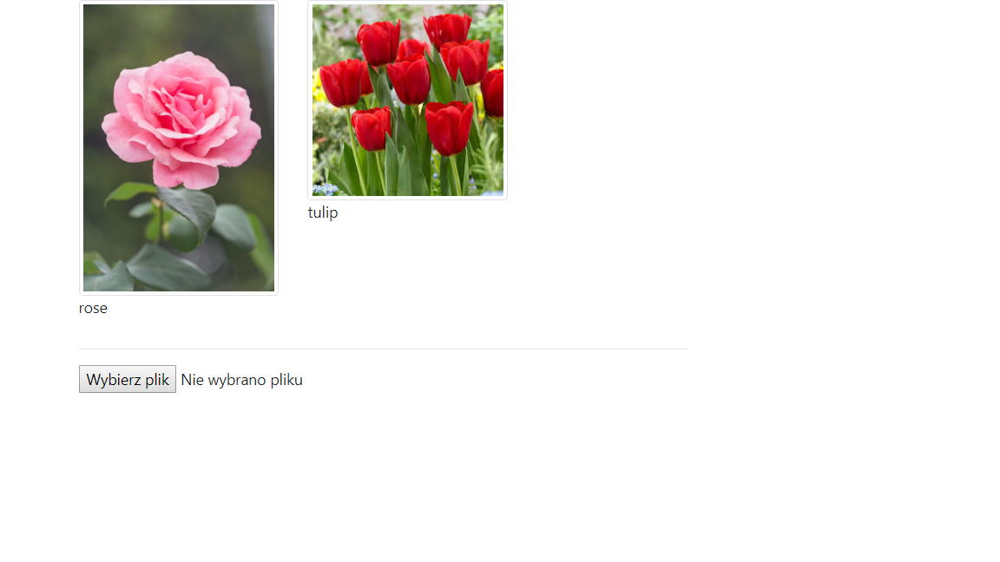

### CNN FLower classifier with Flask 


1. Install minimal libraries by 


``` 
python -m pip install requirements.txt

```

Due to its lightness I decided to use torch with cpu only. 
After installation, 
start application with

``` python

python src/imagenet_api.py


```


then go to 


``` 


localhost:5000

```


and upload your images. 



